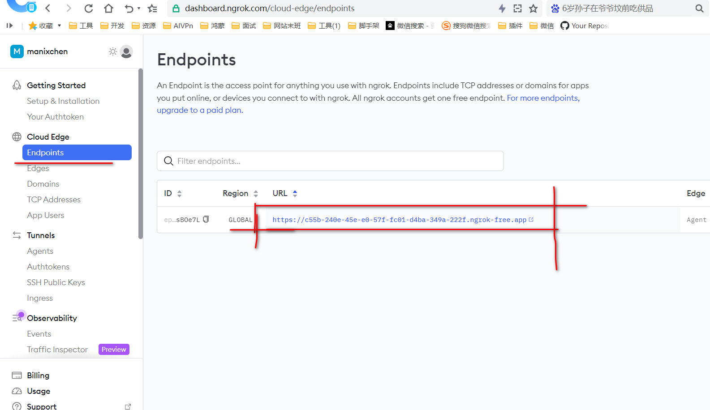

```yaml
layout: post
title:  ngrok免费实现内网穿透
tags: ngrok 内网穿透
categories:ngrok 内网穿透
```

1.什么是ngrok？
ngrok是一个全球分布的反向代理，无论您在哪里运行，它都能保护、保护和加速您的应用程序和网络服务。您可以将ngrok视为应用程序的前门。

ngrok是独立于环境的，因为它可以向任何地方运行的服务提供流量，而不会改变您的环境网络。在 AWS、Azure、Heroku、阿里云、腾讯云本地 Kubernetes 集群、树莓派甚至笔记本电脑上运行您的应用程序。有了ngrok，一切工作都是一样的。

ngrok 是一个统一的入口平台，因为它将所有组件整合到一个组件中，将您的服务传输到互联网。ngrok将您的反向代理、负载平衡器、API网关、防火墙、交付网络、DDoS保护等整合在一起。

2.下载https://ngrok.com/download

3. 注册登录平台可以使用管理端，获取 authtoken
https://dashboard.ngrok.com/get-started/setup/windows

如下格式
ngrok config add-authtoken *********

直接在系统终端添加认证码即可使用服务
ngrok config add-authtoken 2egC1JhNH9q0gykuUuV5weFUFNG_**********

4.开启对应端口映射，直接终端命令行操作即可
ngrok http http://localhost:8080
ngrok http http://192.168.134.1:5173  //我个人的npm服务，测试项目的，开启后可以直接外网访问,可以代替花生壳，总感觉花生壳有限速，一堆的限制就是为了买流量加速包

5.在https://dashboard.ngrok.com/cloud-edge/endpoints 的 Endpoints中可以查看映射的域名

