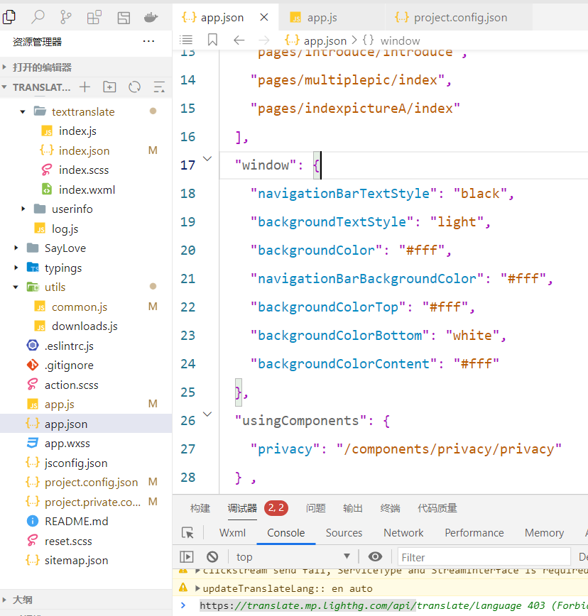

```yaml
layout: post
title:  微信小程序自定义导航栏
tags: 小程序 原生微信开发
categories: 微信小程序开发
```

**** 微信小程序自定义tabbar*
1. 开启sass支持
 project.config.json

 "useCompilerPlugins": [
      "sass"
    ],

2. 微信小程序自带的导航功能比较单一，不支持自定义其他属性和状态，仅支持标题等属性，所以这个就得自定义导航了，比如各类电商工具的导航，带搜索框的这些导航，多语言切换的导航

3.下面我使用自定义导航实现导航栏带语言切换模式，将导航做成一个组件即可，组件自带生命周期函数，也可以根据装配的内容自动识别
    温馨提示：：：自定义导航区分全局和局部，而自定义tabbar仅支持全局配置

全局配置中年  app.json  window 
官网配置已经很全![https://developers.weixin.qq.com/miniprogram/dev/reference/configuration/app.html]
window
用于设置小程序的状态栏、导航条、标题、窗口背景色。

属性	类型	默认值	描述	最低版本
navigationBarBackgroundColor	HexColor	#000000	导航栏背景颜色，如 #000000	
navigationBarTextStyle	string	white	导航栏标题、状态栏颜色，仅支持 black / white	
navigationBarTitleText	string		导航栏标题文字内容	
navigationStyle	string	default	导航栏样式，仅支持以下值：
default 默认样式
custom 自定义导航栏，只保留右上角胶囊按钮。参见注 2。	iOS/Android 微信客户端 6.6.0，Windows 微信客户端不支持
homeButton	boolean	default	在非首页、非页面栈最底层页面或非tabbar内页面中的导航栏展示home键	微信客户端 8.0.24


4. 全局配置如下：
//系统默认支持配置的选项
{
  "window": {
    "navigationBarBackgroundColor": "#ffffff",
    "navigationBarTextStyle": "black",
    "navigationBarTitleText": "微信接口功能演示",
    "backgroundColor": "#eeeeee",
    "backgroundTextStyle": "light",
     "usingComponents": {//自定义的导航组件，需要注意全局的将会全局生效，，如果只是部分页面需要的话可以局部定制导航，这一点还是比较方便的
            "custom-nav": "/components/custom-nav/custom-nav"
        }
  }
}


5.  局部页面配置方式:如首页导航自定义（AIBoot\pages\index）,自动覆盖全局配置
在对应的页面index.json 文件修改即可
{
  "component": true,
  "navigationStyle": "custom",
  "usingComponents": {
    "navigation-bar": "/custom-nav-bar" //可以放在任意目标
  }
}

 
页面中引用用即可
  <view class="header" style="height: {{navbarWidthStatus}};">  

      <navigation-bar    canBack="{{false}}"      color-animation-duration="2000"  color-animation-timing-func="easeIn"    />  
   </view>


6.完整实现案列：
AIBoot\custom-nav-bar
index.js
    ```
    const app = getApp();
        Component({ 
            // 接收父组件数据
        properties: {
            canBack: Boolean,  
            onytitle: Boolean,  
            title: String,  
            currentLang: { 
                type: String, 
                value: 'auto' 
            },
            currentTargetLang: { 
                type: String, 
                value: 'zh' 
            },
        },

        data: { 
            langList: app.globalData.lang, 
            editLang:false, 
            updateLang:"auto",
            updateTargetLang:"zh",
            statusBarHeight: app.globalData.statusBarHeight, //状态栏栏高度
            navBarHeight: app.globalData.navBarHeight, //导航栏高度
            navbarWidthStatus: app.globalData.navbarWidthStatus, //导航栏加状态栏高度
            menuRight: app.globalData.menuRight, //导航栏胶囊距离右侧距离
            menuHeight: app.globalData.menuHeight, //导航栏胶囊高度
            screenHeight: app.globalData.screenHeight, //可视区域高度  
            screenWidth: app.globalData.screenWidth , //可视区域高度  
        }, 
        methods: {
            lifetimes: {
                attached: function () {
                    console.log("执行初始化 attached")
                },
                detached: function () { 
                },
            },
            // 读取语言数据
            getLangList(){ 
                const langData = wx.getStorageSync("langData")||app.globalData.langData;
                if(!langData){
                    return false;
                }  
                this.setData({
                    langData:langData,
                }); 
                return langData;
            },
            // 返回翻译
            back(e) {
                var that = this
                // 控制点击事件在350ms内触发，加这层判断是为了防止长按时会触发点击事件
                if (that.data.touchEndTime - that.data.touchStartTime < 350) { 
                    var currentTime = e.timeStamp; // 当前点击的时间
                    var lastTapTime = that.data.lastTapTime;
                    // 更新最后一次点击时间
                    that.data.lastTapTime = currentTime;
                    // 如果两次点击时间在200毫秒内，则认为是双击事件
                    if (currentTime - lastTapTime < 200) {
                        // 双击事件
                        clearTimeout(that.data.lastTapTimeoutFunc);
                        console.log("double click");
                        wx.redirectTo({
                            url: 'index'
                        })
                    } else {
                        that.data.lastTapTimeoutFunc = setTimeout(function () {
                                    // 单击事件
                            console.log("double click")
                            wx.redirectTo({
                            url: 'index'
                            })
                        }, 200);
                    }
                }else{
                    wx.navigateBack({
                     delta: 1,
                    }); 
                }
            },
            // 是否操作语言
            selectLang(e) {  
                let langData = wx.getStorageSync("langData");
                const tThis=this;
                if(langData){
                langData = tThis.getLangList(); 
                tThis.setData({
                    editLang:this.data.editLang?false:true,
                    langData:langData
                }); 
                }else{
                // 异步请求并更新语言
                app.getLangConfig(function(){
                    langData = tThis.getLangList();
                    tThis.setData({
                    editLang:tThis.data.editLang?false:true,
                    langData:langData
                    });
                });
                }  
            },  
            // 源语言改变
            fromIdxChange(e) {
                const dataset = e.target.dataset; 
                let changeLang = {};  
                if(dataset.langType=="fromIdx"){//源语言切换 
                    changeLang.updateLang=dataset.index;
                }else{//目标语言切换 
                    changeLang.updateTargetLang=dataset.index;
                }  
                this.setData(changeLang);
            },
            // 提交切换语言
            updateTranslateLang(){
                const updateLang = this.data.updateLang||"auto";
                const updateTargetLang = this.data.updateTargetLang||"en";
                if(updateLang==updateTargetLang){
                        wx.showToast({
                    title: '源语言和目标语言不能一致',
                    icon: 'error',
                    duration: 2000
                    })
                return false;
                }
                const newLang ={};
                //导航栏当前语言
                newLang['currentLang']=updateLang;
                newLang['currentTargetLang']=updateTargetLang;
                wx.setStorageSync("currentLang", updateLang); 
                wx.setStorageSync("currentTargetLang", updateTargetLang); 
                const updata = app.updateGlobalLang(updateLang,updateTargetLang); 
                app.globalData.currentLang=updateLang;// 
                app.globalData.currentTargetLang=updateTargetLang;//

                newLang.editLang=this.data.editLang?false:true;
                this.setData(newLang); 
                this.triggerEvent('callFun');//提交语言的父组件回调，具体看需求需不需要
            },
            setNavBarInfo() {// 获取系统信息
                
                const systemInfo = wx.getSystemInfoSync();
                if (systemInfo.platform === 'android' || systemInfo.platform === 'ios') {
                    this.globalData.isMobile=true;
                } else if (systemInfo.platform === 'windows' || systemInfo.platform === 'mac') {
                } else {
                }
                // 胶囊按钮位置信息
                const menuButtonInfo = wx.getMenuButtonBoundingClientRect();
                // 导航栏高度 = 状态栏到胶囊的间距（胶囊距上距离-状态栏高度） * 2 + 胶囊高度 + 状态栏高度
                const menuButtonToStatus = (menuButtonInfo.top - systemInfo.statusBarHeight/2); 
                this.globalData.navBarHeight = (menuButtonInfo.top - systemInfo.statusBarHeight) * 2 + menuButtonInfo.height+10;
                this.globalData.navbarWidthStatus = this.globalData.navBarHeight+systemInfo.statusBarHeight;
                this.globalData.statusBarHeight = systemInfo.statusBarHeight;
                this.globalData.menuRight = systemInfo.screenWidth - menuButtonInfo.right;
                this.globalData.menuLeftwidth = menuButtonInfo.left;
                this.globalData.screenWidth = systemInfo.screenWidth;
                this.globalData.screenHeight = systemInfo.screenHeight-this.globalData.navbarWidthStatus;
            },
            // 撤销语言修改语言
            oldTranslateLang(){ 
                // app.showModalClose("未切换语言...",300);
                this.setData({editLang:this.data.editLang?false:true});
            } 
         }
    })

    ```

    //index.json
    ``` 
    {
    "component": true
    }
    ```

    //index.scss
    ```
      .text{
            color: rgba(255,255,255);
        }
        .page-title{
            text-align: center;
            width: 100%;
            line-height: 70px;
            font-size: 36rpx;  
            font-weight: bold;
            letter-spacing: 0rpx;
        }
        /* 顶部导航栏(  全局语言切换) */
        .tab-top{ 
            width: 100%; 
            display: flex;  
            .current-language-box{ 
            display: flex;
            flex-wrap: nowrap;
            align-items:center; 
            overflow: hidden; 
                .tab-lang-switch {
                    margin-left: 50rpx; 
                    .lang-text{    
                        font-size: 36rpx;
                        font-weight: bold;
                        letter-spacing: 0rpx;
                        text-align: left;
                        /* vertical-align: top;    */
                        /* word-break: keep-all; */
                        text-overflow: ellipsis;
                        overflow: hidden;
                    }
                    .lang_switch{ 
                        display: inline-flex;
                        font-size: 24rpx;   
                        margin:  10rpx 40rpx;
                        /* transform: translateY(6rpx);  */
                        width: 32rpx;
                        height: 32rpx;
                        opacity: 1; 

                    }
                    .lang_switch.left-20{
                        margin-left: 20rpx;
                    }
                }
        
                .btn-back{
                /* transform:scale(1.2) translateY(-5rpx); */
                width: 48rpx;
                height: 48rpx;
                opacity: 1;    
                margin:0 0  0  30rpx; 
                }  
                .text-active{
                    color: #07c160;
                }
            }
        } 


        /* 全局语言切换容器 */
        .section-box-lang{ 
            width: 100%;
            background-color: #fff;
            border-top: 2rpx solid #f6f8fa; 
            position: fixed;
            align-items: center;
            box-sizing: border-box;
            display: none;
            z-index: 9999 ;
            &.edit-lang{ 
                display:block;
            } 
            .lang-flex-item{
                width: 100%;
                height: 100%;
                text-align: center;
                background-color: transparent;
                color: #000;
                position: relative;  
                opacity: 1; 
                /* border: 2rpx solid #f6f8fa; */
                box-sizing: border-box;
                display: flex;
                flex-direction: column;
                justify-content: space-between;
            }
            .form-scroll{
                border-right: 2rpx solid #f6f8fa;
            } 
            .scroll-box{  
                /* var(--point-final-height) */
                overflow-y: auto; 
                /* flex-direction: row; */
            }
            .lang-box{
                display: inline-block;
                height: 100%;
                overflow-y: auto;
                width: 50%;
                box-sizing: border-box;
                padding: 0 30rpx;
                vertical-align: top;
                /* flex-direction: column;
                flex:1; */
                .lang-item{
                    width: 314rpx;
                    /* width: 100%; */
                    display: inline-block;
                    height: 70rpx;
                    line-height: 70rpx;
                    border-radius: 8rpx; 
                    font-size: 32rpx;
                    font-weight: normal;
                    letter-spacing: 0rpx;
                    color: #000;
                    text-align: center;
                    vertical-align: top;
                    background: #fff;
                    border:0 solid  transparent;
                    outline: none;
                    outline-style: none;
                    box-shadow: none;
                    background-color: #fff;
                    -webkit-tap-highlight-color: transparent;
                    &:first-child{
                        margin-top: 32rpx;
                    }
                    .selected{
                        background: linear-gradient(135deg, #07c160 0%, #07c160 100%);
                        color: #fff;
                        font-weight: bold;
                    }
                }
            } 
            

        /* 语言切换的操作按钮 */
        .bootom-action{
            display: flex;
            flex-direction: row;
            width: 100%;
            height: 110rpx;
            line-height: 110rpx; 
            align-items: center;
            font-weight: bold;
            color: #fff;
            background: linear-gradient(135deg, #f9f9fa 0%, #f9f9fa 100%);
            border-bottom-left-radius: 20rpx;
            border-bottom-right-radius: 20rpx;
            z-index: 300;
            .lang-action-btn{
                display: flex;
                flex: 1; 
                justify-content: center;
                font-size: 34rpx;
                font-weight: bold;
                letter-spacing: 0rpx; 
                color: rgba(255, 255, 255, 1);
                &.selected{
                    background:#2474FF;
                    box-sizing: border-box;
                    border-bottom-right-radius: 20rpx; 
                    /* background: linear-gradient(135deg, #07c160 0%, #07c160 100%); */
                }
            }
        }
        
        }    
        

        
    ```

    //index.wxml
    ``` 
    <!-- 状态栏空出来状态栏高度，官方API提供接口 -->
    <view style="height: {{statusBarHeight}}px;width:100%;"></view>
    <!-- 语言切换容器 -->
    <view class="tab-bar tabbar tab-top"  >
        <view class="current-language-box " 
        style="height:{{(navBarHeight)}}px;display: flex;width:{{menuLeftwidth}}px;">  
            <block wx:if="{{canBack || onytitle}}">  
                    <image   image  class="btn-back" bindtap="back"  src="/images/backnav.png" mode="aspectFill" lazy-load="false"></image>
                    
            </block>   
            <!-- 只显示标题的特殊处理，其他的全部显示 -->
            <block wx:if="{{onytitle}}">   
            <view class="nav-page-title" style="display: flex;width:{{menuLeftwidth-50}}px;" >
                <text  class="page-title" > {{title}}</text></view>
            </block>    
            <block wx:else>  
            
            <view   style="height:{{(navBarHeight)}}px;line-height:{{(navBarHeight)}}px;    class="tab-lang-switch"    bindtap="selectLang">
                <text class="lang-text text-active">{{langData[currentLang]}}</text>
                <image class="lang_switch" mode="aspectFill" src="/images/icon/switch.png"></image> 
                <text  class="lang-text text-active">{{langData[currentTargetLang]}}</text>
                <image class="lang_switch"   mode="aspectFill" src="{{editLang?'/images/icon/up.png':'/images/icon/down.png'}}"></image> 
            </view>
            </block>   
        </view>
    </view>
    
    <!-- 语言容器 --> 
    <view class="section-box-lang {{editLang?'edit-lang':''}}"  style="height: {{screenHeight}}px;">     
        <!-- 源语言 -->
        <view  class="lang-flex-item "  > 
            <view class="scroll-box" style="height:{{screenHeight-navbarWidthStatus}}px;" type="list"	scroll-y="true" >
                <view class="lang-box form-scroll">
                    <text   class="lang-item {{updateLang==idx?'selected':''}}" 
                            bind:tap="fromIdxChange"  wx:for-index="idx"    wx:for="{{langData}}" wx:key="*this"  data-lang-type="fromIdx"   data-index="{{idx}}">{{item}}</text>
                </view>
                <view class="lang-box">
                    <text  type="button" bind:tap="fromIdxChange" class="lang-item {{updateTargetLang==idx?'selected':''}}"  wx:for-index="idx" 
                    wx:for="{{langData}}"  wx:key="*this" data-lang-type="toIdx"  data-index="{{idx}}" > 
                    {{item}}</text>
                </view>
            </view>
                <view class="bootom-action" >
                    <button class="lang-action-btn" data-action="0"  bind:tap="updateTranslateLang">取消选择</button>
                    <button class="lang-action-btn selected"  data-action="1"  bind:tap="updateTranslateLang">确认语言</button>
                </view> 
        </view>    
    </view> 
    ```