```yaml
layout: post
title:  vscode uniapp  开发环境配置
tags: uniapp vscode
categories: uniapp
```
####  uniapp安装的前提 
>现代化web开发避免不了混合应用开发，降本增效的必要， 想必hbuilderx的语法提示以及插件没有webstorm和vscode方便，让开发效率大大折扣，其实用vscode好处就是装多少插件都丝毫不卡顿，下面你也可以按照我的方法尝试一下
>
 


#### 1.直接使用vscode打开uiapp创建的项目目录即可
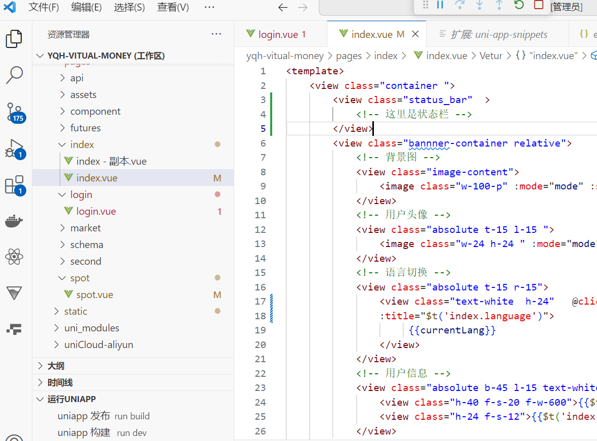

#### 2.安装 uniapp相关插件
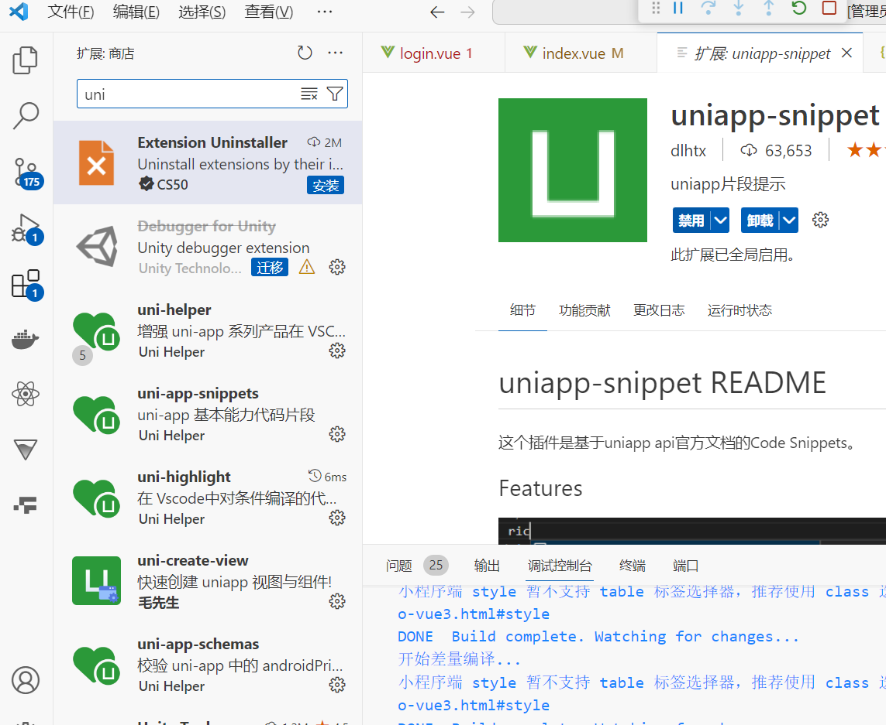


#### 3.uniapp-run 配置，实现 命令uniapp-run 运行项目到小程序相关工具
>基于HBuilderX的采用uniapp-cli命令的方式，进行编译且可以自动打开第三方开发者工具的VS Code插件

本项目适用于没有采用CLI命令的uniapp项目，原需要HBuilderX进行编译的
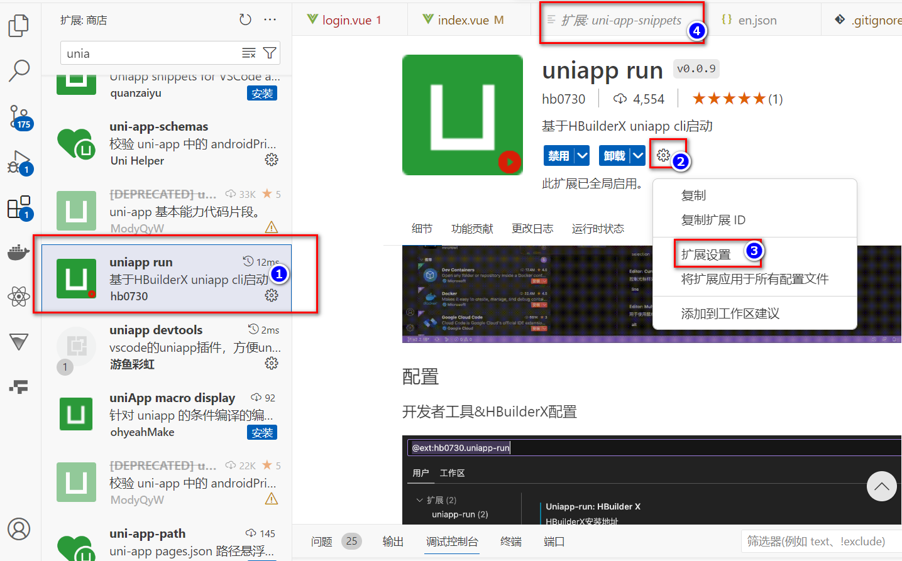


 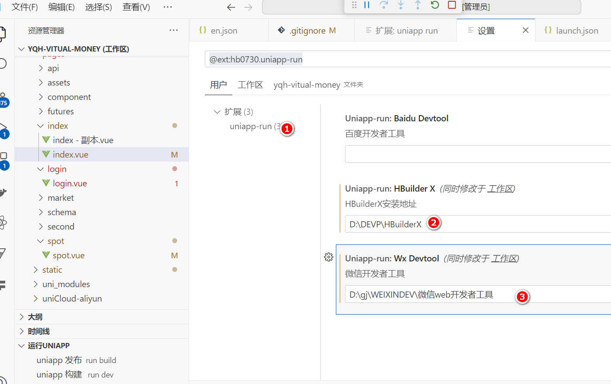


#### 4. 如果第一次使用可以使用默认模版方式快速创建launch.json
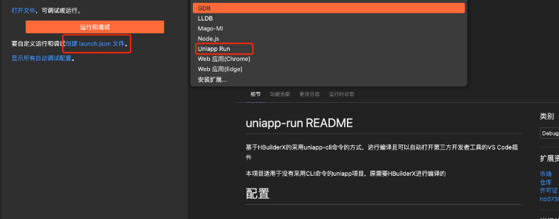
launch.json 参数

{
    "type": "uniapp-run",
    "request": "launch",
    "name": "Uniapp Run",
    "platform": "mp-weixin"
}

type: 必须是 uniapp-run
request: 必须是: launch
name: 随便填写
platform: 编译成的平台，与uniapp基本保持一致: mp-weixin,mp-alipay,mp-baidu等
src: 项目路径，默认当前项目路径
compress: 是否运行时压缩
openDevTool: 是否自动打开第三方开发者工具
vueVersion: vue版本，目前支持2和3，默认2
命令方式
uniapp-run.run: 运行uniapp项目
uniapp-run.publish: 发布uniapp项目
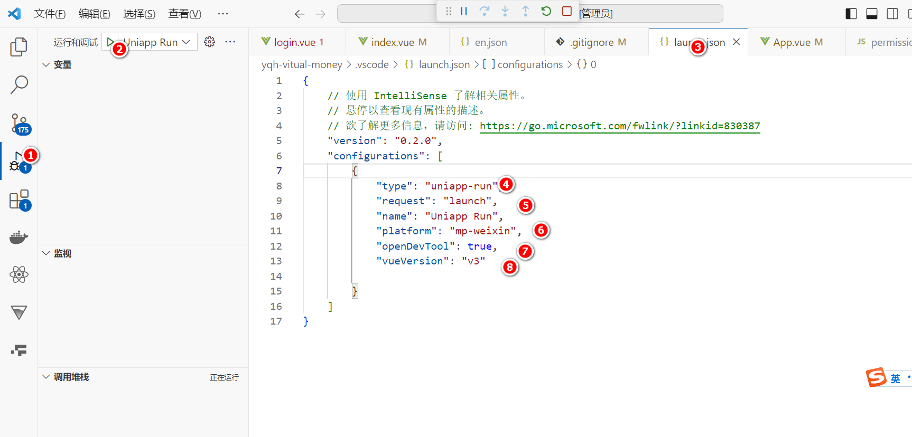


#### 5. 运行项目看看具体情况
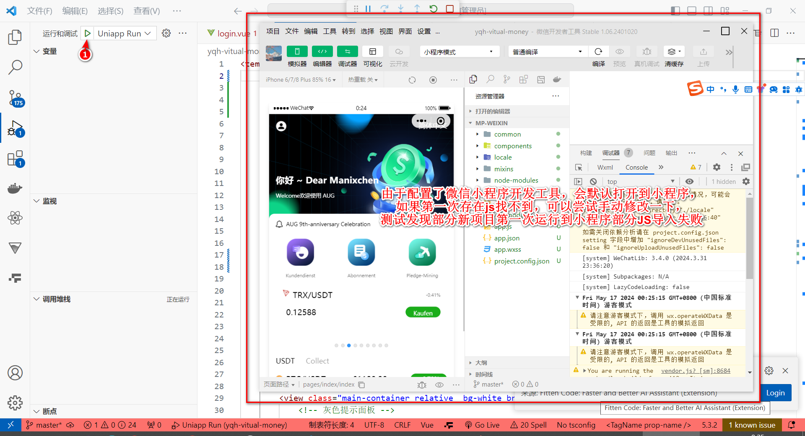


#### 6. 微信开发工具细节 
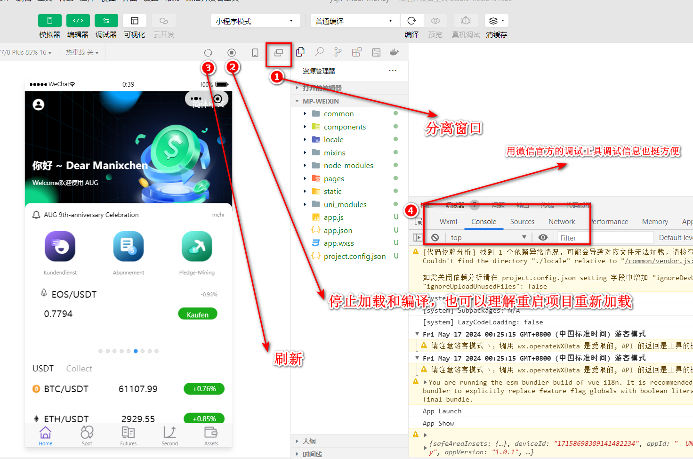
* 分离后开发更方便 
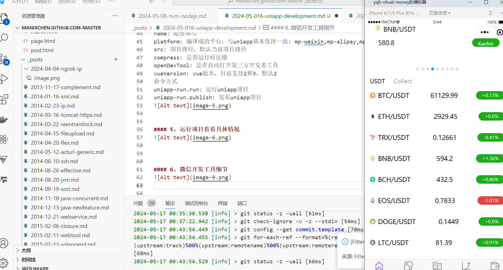


>   需要注意的情况
1. 默认情况json中存在注释的话编辑器中json会报错
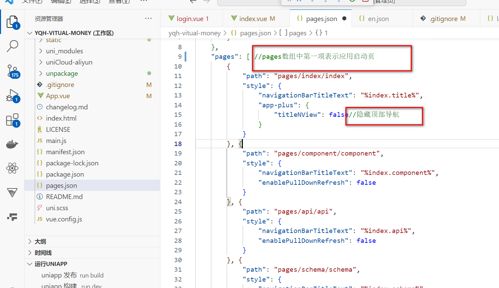

2. 解决办法C:\Users\Administrator\AppData\Roaming\Code\User\settings.json
添加如下配置
```
"files.associations":{
        "pages.json":"jsonc",
        "manifest.json": "jsonc"
    },
```
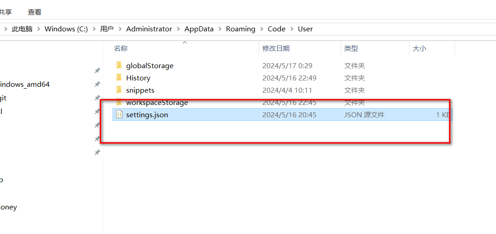

> 我的完整配置
```
{
    "explorer.confirmDelete": false,
    "git.enableSmartCommit": true,
    "[vue]": {
        "editor.defaultFormatter": "octref.vetur"
    },
    "[javascript]": {
        "editor.defaultFormatter": "esbenp.prettier-vscode"
    },
    "editor.minimap.enabled": false,
    "window.zoomLevel": 1,
    "tabnine.experimentalAutoImports": true,
    "[css]": {
        "editor.defaultFormatter": "vscode.css-language-features"
    },
    "[typescript]": {
        "editor.defaultFormatter": "esbenp.prettier-vscode"
    },
    "workbench.colorTheme": "Visual Studio 2019 Light",
	"files.associations":{
        "pages.json":"jsonc",
        "manifest.json": "jsonc"
    },
    "uniapp-run.HBuilderX": "D:\\DEVP\\HBuilderX",
    "uniapp-run.wxDevtool": "D:\\gj\\WEIXINDEV\\微信web开发者工具"
}
```